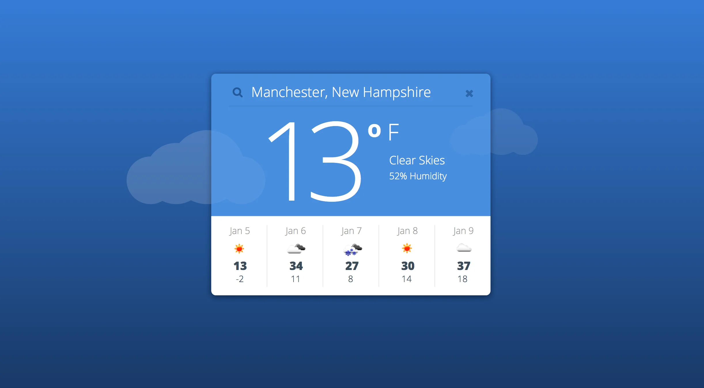
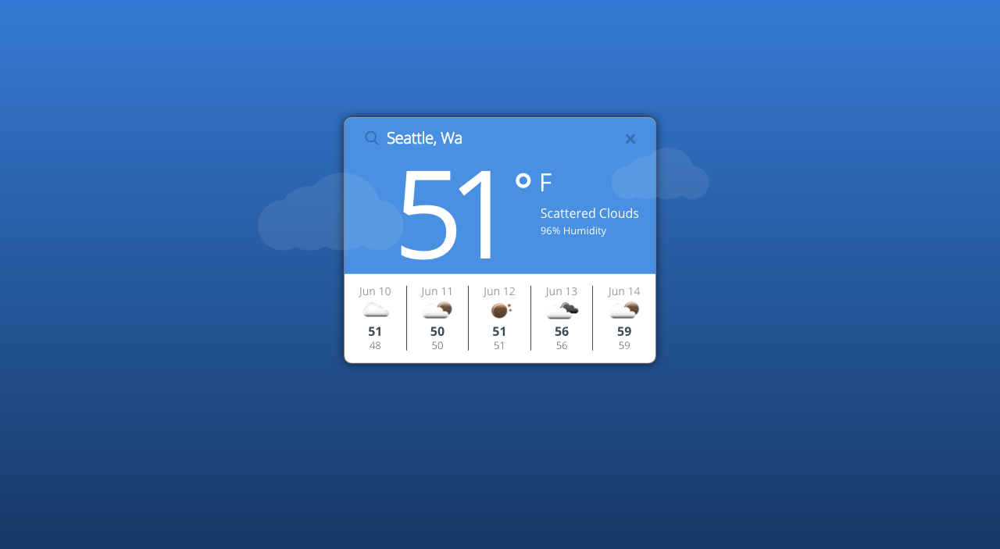

# Project : Weather-App

Simple single page weather app. This was a UI challenge, I was given a photo and told to duplicate it as closely as possible. From a functionality stand point I leveraged cookies to improve latency and limit unnecessary requests. I also utilized navigator's geolocation to find the user's current location, if the user's browser does not have this functionality or the user declines to share their location, then I look up their IP address and use the address asscoiated with their IP.

## Goal

## Result

## Tech/Framework/Packages

- Node 
- heroku
- github
- npm/yarn
- Frontend Node packages:
  - Autoprefixer          
  - Babel-core         
  - Babel-plugin-transform-class-properties          
  - Babel-plugin-transform-object-rest-spread          
  - Babel-preset-env          
  - Babel-preset-react                        
  - Cors                   
  - Dotenv          
  - Express          
  - Node-sass         
  - NPM          
  - Parcel-bundler
  - Postcss-modules          
  - React                   
  - React-dom          
  - React-redux          
  - React-router          
  - React-router-dom          
  - Redux                          
  - Superagent                                 
- devDependencies:
  - Babel-jest
  - Babel-plugin-stylus-compiler
  - Babel-plugin-transform-async-to-generator
  - Babel-plugin-transform-css-import-to-string
  - Babel-plugin-transform-es2015-modules-amd
  - Babel-plugin-transform-es3-member-expression-literals
  - Babel-plugin-transform-es3-property-literals
  - Babel-plugin-transform-object-assign
  - Babel-plugin-transform-version-inline
  - Babel-preset-es2015
  - Babel-preset-stage-0             
  - Eslint          
  - Eslint-plugin-react          

## How to use?
Clone this repo, cd into the cloned project folder, run `npm install`. From here run `npm run watch or yarn watch` and go to localhost:1234. From here type in a city ex. Seattle to get a 5 day forecast.

## Contribute

You can totally contribute to this project if you want. Fork the repo, make some cool changes and then submit a PR.

## License

MIT. Use it up!